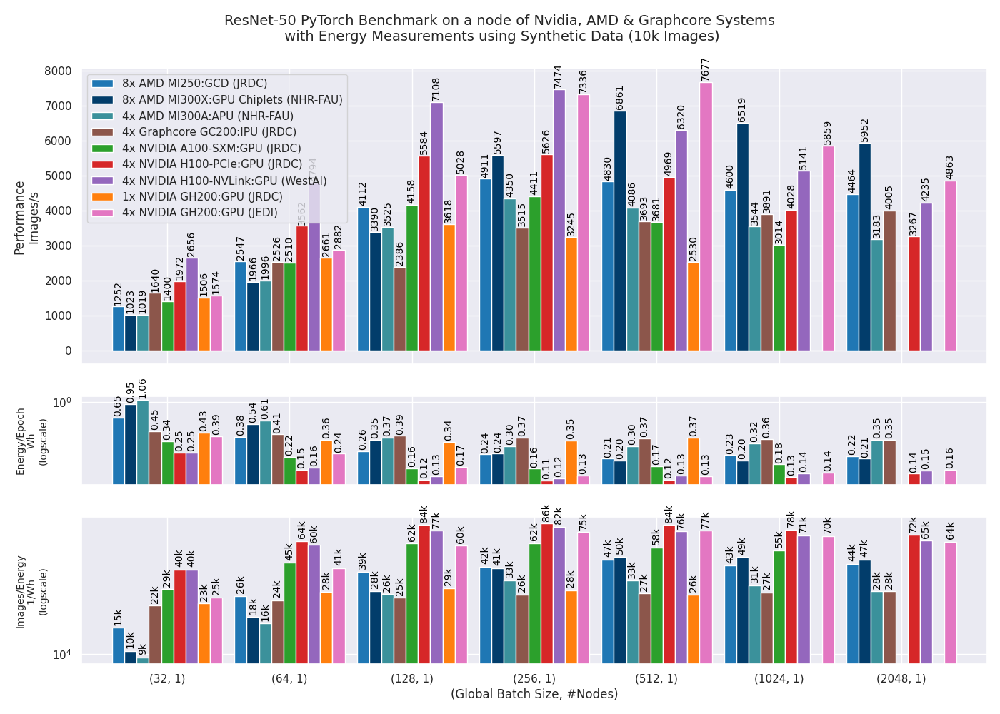
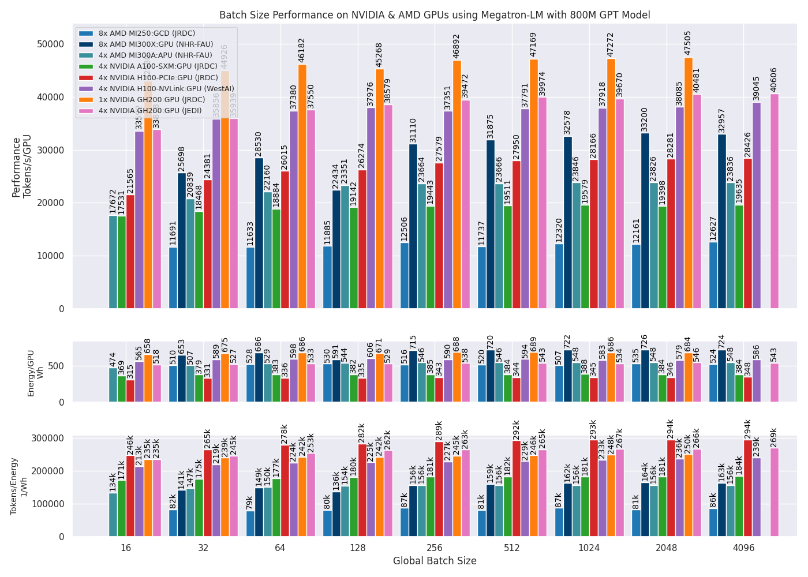
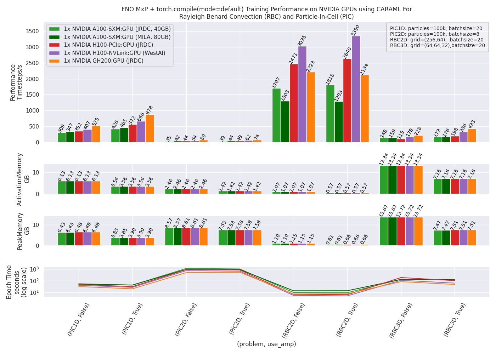

# CARAML

**C**ompact **A**utomated **R**eproducible **A**ssessment of **M**achine **L**earning (**CARAML**) is a benchmark framework designed to assess AI workloads on novel accelerators. It has been developed and tested extensively on systems at the Jülich Supercomputing Centre (JSC).

CARAML leverages [JUBE](https://github.com/FZJ-JSC/JUBE), a scripting-based framework for creating benchmark sets, running them across different systems, and evaluating results. Additionally, it includes power/energy measurements through the [jpwr](https://github.com/FZJ-JSC/jpwr) tool.

Paper: [Arxiv](https://arxiv.org/abs/2409.12994), [IEEE](https://ieeexplore.ieee.org/abstract/document/10820809)

# Tested Accelerators

CARAML has been tested on the [JURECA-DC EVALUATION PLATFORM](https://apps.fz-juelich.de/jsc/hps/jureca/evaluation-platform-overview.html), [JURECA-DC](https://apps.fz-juelich.de/jsc/hps/jureca/configuration.html), [JEDI](https://apps.fz-juelich.de/jsc/hps/jedi/index.html#), [WEST-AI Nodes](https://westai.de/services/hardware/), [NHR-FAU](https://doc.nhr.fau.de/clusters/testcluster/) and [Mila](https://docs.mila.quebec/Information.html#node-profile-description). These include the accelerators: 

```markdown
| System                                            | Configuration                                     | Tag       |
|---------------------------------------------------|---------------------------------------------------|-----------|
| NVIDIA Ampere node (SXM)                          | 4 × A100 (40GB HBM2e) GPUs                        | `A100`    |
| NVIDIA Ampere node (SXM)                          | 4 × A100 (80GB HBM2e) GPUs                        | `MILA`    |
| NVIDIA Hopper node (PCIe)                         | 4 × H100 (80GB HBM2e) GPUs                        | `H100`    |
| NVIDIA Hopper node (NVLink)                       | 4 × H100 (94GB HBM2e) GPUs                        | `WAIH100` |
| NVIDIA Grace-Hopper chip                          | 1 × GH200 (480GB LPDDR5X, 96GB HBM3) GPU          | `GH200`   |
| NVIDIA Grace-Hopper node                          | 4 × GH200 (120GB LPDDR5X, 96GB HBM3) GPUs         | `JUPITER` |
| AMD MI300X node                                   | 8 × MI300X (192GB HBM3) GPUs                      | `MI300X`  |
| AMD MI300A node                                   | 4 × MI300A (128GB HBM3) APUs                      | `MI300A`  |
| AMD MI200 node                                    | 4 × MI250 (128GB HBM2e) GPUs                      | `MI250`   |
| Graphcore IPU-POD4 M2000                          | 4 × GC200 (512GB DDR4-3200) IPUs                  | `GC200`   |
```
> **Note**: `MILA` tag is supported only for FNO Benchmark.

# Benchmark

CARAML currently provides benchmarks implemented in Python:
### 1. Computer Vision: Image Classification (Training)
The [image_classification](./image_classification/) model training benchmark is implemented in PyTorch. It is designed to test image classification models such as ResNet50 on various accelerators. For IPU's [graphcore/examples](https://github.com/chelseajohn/examples) is used. 

Performance is measured in `images/s` and energy is measured in `Wh`.

> **Note**: Support for the image classification benchmark in TensorFlow has been discontinued.

### 2. Natural Language Processing: GPT Language Model (Training)
The [LLM-training](./llm_training/) benchmark is implemented in PyTorch with:
- [Megatron-LM](https://github.com/NVIDIA/Megatron-LM.git) with commit: `f7727433293427bef04858f67b2889fe9b177d88` and [patch](./aux/nvidia_megatron_energy_llm_fix.patch) applied for NVIDIA
- [Megatron-LM-ROCm](https://github.com/bigcode-project/Megatron-LM.git) with commit: `21045b59127cd2d5509f1ca27d81fae7b485bd22` and [patch](./aux/amd_megatron_energy_llm_fix.patch) applied for AMD 
- [graphcore/examples](https://github.com/chelseajohn/examples) (forked version) for Graphcore

Performance is measured in `tokens/s` and energy is recorded in `Wh`.

### 3. Neural Operator: Fourier Neural Operator (FNO)
The [operator-benchmark](./operator_benchmark/) is implemented in PyTorch with [operator_learning](https://github.com/chelseajohn/operator_learning) for NVIDIA systems. 

It enables comprehensive analysis of mixed-precision training and the performance impact of `torch.compile` during both training and inference of FNO models.

The benchmark includes experiments on two representative problems: 
- Rayleigh–Bénard convection (RBC) in 2D and 3D 
- Plasma simulation using Particle-in-Cell (PIC) methods in 1D and 2D.

Performance is measured in `timesteps/s`.

# Requirements

To run the benchmarks, install **JUBE** following [JUBE Installation Documentation](https://apps.fz-juelich.de/jsc/jube/docu/tutorial.html#installation) setup instructions. The benchmarks are deployed using [Apptainer](https://apptainer.org/) containers and executed using **SLURM** on the tested accelerators.

## Dataset

- **Image Classification**: Synthetic data is generated on the host machine for benchmarking. The IPU tag `synthetic` additionally allows for the generation of synthetic data directly on the IPU.
  
- **LLM Training**: A subset of the [OSCAR dataset](https://huggingface.co/bigscience/misc-test-data/resolve/main/stas/oscar-1GB.jsonl.xz) (790 samples, ~10 MB) is pre-processed using [GPT-2 tokenizers](./llm_training/aux/tokenizers/). This data is provided in the `llm_data` directory.

- **FNO Benchmark**: Data from numerical solvers for RBC and PIC is cloned from [huggingface repository](https://huggingface.co/datasets/chelseajohn/FNOBenchmark) during setup phase of benchmark using [setup_fno_env.sh](./operator_benchmark/setup_fno_env.sh) and kept at `operator_benchmark/fno_data`.

# Execution

- Clone the repository and navigate into it:

```bash
git clone https://github.com/FZJ-JSC/CARAML.git
cd CARAML
```

- Modify the `system` and `model` parameters in the respective JUBE configuration file.
- To pull the required container use the `container` tag as follows:
    ```bash
    jube run  {JUBEConfig}.{xml,yaml} --tag container H100
    ```
   Replace `H100` with one of the following as needed:
   - `GH200` (for Arm CPU + H100)
   - `MI250` or `MI300X` or `MI300A` (for AMD)
   - `GC200` (for Graphcore)
> **Note**: The `container` tag should ideally be used only once at the beginning to pull and set up the container and environment.

## Image Classification (Training)

- To run the benchmark with defined configurations do
    ```bash
    jube run image_classification/image_classification_torch_benchmark.xml --tag H100
    ```

    `H100` can be replaced with any tag mentioned in [tested accelerators](#tested-accelerators) section.

- After the benchmark has been executed, use `jube continue` to postprocess results
    ```bash
   jube continue image_classification/image_classification_torch_benchmark_run -i last
   ```

- To generate result do:
   ```bash
  jube result image_classification/image_classification_torch_benchmark_run -i last
   ```

## LLM Training

- To run the benchmark with defined configurations for `800M` GPT model with OSCAR data do:
    ```bash
    jube run llm_training/llm_benchmark_nvidia_amd.yaml --tag 800M A100
    ```
    `A100` can be replaced with any tag mentioned in [tested accelerators](#tested-accelerators) section and `800M` can be replaced with `13B` and `175B` for systems with more node resources.

- To run the benchmark with defined configurations for `117M` GPT model on Graphcore with synthetic data  do
    ```bash
    jube run llm_training/llm_benchmark_ipu.yaml --tag 117M synthetic
    ```
    If tag `synthetic` is not given, the benchmark will use OSCAR data.

- After the benchmark has been executed, use `jube continue` to postprocess results
    ```bash
    jube continue llm_training/llm_benchmark_{nvidia_amd,ipu}_run -i last
   ```
- To generate result do:
   ```bash
   jube result llm_training/llm_benchmark_{nvidia_amd,ipu}_run -i last
   ```

## FNO Benchmark

To run all problems (`PIC1D`, `PIC2D`, `RBC2D`, `RBC3D`) use `all` tag otherwise use the respective problem tag. 

- Distributed Training: Add the `ddp` tag to enable distributed data parallel (DDP) training.
- Torch.compile: To run `torch.compile` with different modes of execution for inference use `eval` tag.

Example to run training in mixed precision with different `torch.compile` modes on `H100`:

`jube run operator_benchmark/fno_benchmark.yaml --tag H100 all`

`H100` can be replaced with any tag mentioned in [tested accelerators](#tested-accelerators) section.

# Results




 
# JSC Specific Fixes
In order to use PyTorch `torch run` API on JSC systems [fixed_torch_run.py](./llm_training/aux/fixed_torch_run.py) fix is required. The fix solves the issue defined [here](https://github.com/pytorch/pytorch/pull/81691).

Additionally the `hostname` is appended with an `i` for allowing communication over InfiniBand as described [here](https://apps.fz-juelich.de/jsc/hps/juwels/known-issues.html#ip-connectivity-on-compute-nodes).

# Citation

```
@INPROCEEDINGS{10820809,
  author={John, Chelsea Maria and Nassyr, Stepan and Penke, Carolin and Herten, Andreas},
  booktitle={SC24-W: Workshops of the International Conference for High Performance Computing, Networking, Storage and Analysis}, 
  title={Performance and Power: Systematic Evaluation of AI Workloads on Accelerators with CARAML}, 
  year={2024},
  pages={1164-1176},
  doi={10.1109/SCW63240.2024.00158}
  }

```